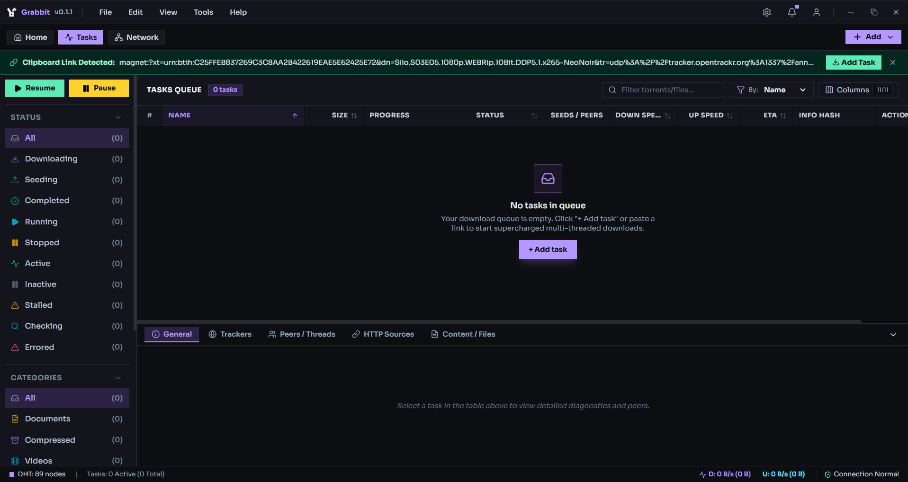

<div align="center">

  
  <h1>Grabbit</h1>

  <p><strong>High-Performance, Hyper-Fast Modern Desktop Download Manager &amp; WebTorrent Engine</strong></p>

  <p>
    <a href="https://github.com/HawkdotDev/grabbit/blob/main/LICENSE">
      
    </a>
    <a href="https://github.com/HawkdotDev/grabbit/releases">
      
    </a>
    <a href="https://electronjs.org">
      
    </a>
    <a href="https://webtorrent.io">
      
    </a>
    <a href="https://typescriptlang.org">
      
    </a>
    <a href="https://react.dev">
      
    </a>
    <a href="https://tailwindcss.com">
      
    </a>
  </p>

  <br />

  

</div>

## Overview

**Grabbit** is a powerful, modern desktop download manager and BitTorrent client built to deliver raw speed, rich telemetry, and complete control over your downloads. Powered by multi-threaded HTTP chunk acceleration and an integrated **WebTorrent** protocol engine, Grabbit handles direct downloads, torrent files, and magnet URIs with dark-mode aesthetic.

## Key Features

- **Multi-Chunk Acceleration**: Splits large HTTP/HTTPS downloads into up to 32 parallel worker threads to saturate your internet bandwidth.
- **Native WebTorrent BitTorrent Engine**: Full BitTorrent protocol support for magnet URIs (`magnet:?xt=`) and `.torrent` files with DHT, PeX, and LSD peer discovery.
- **Top 24 Swarm Supervisor**: Evaluates real piece overlap and sustained throughput to lock onto the fastest seeders while cycling DHT/PEX slots.
- **BEP 10 Extended Handshake & Swarm Client Decoding**: Real-time identification of P2P swarm peer client software (qBittorrent, µTorrent, Transmission, Deluge, WebTorrent, Vuze, BiglyBT, Grabbit) with dynamic Azureus Peer ID decoding.
- **Dynamic Client Identification**: Broadcasts native client identity (`Grabbit v0.3.0` / `-GR0300-`) automatically mapped to `package.json` semver.
- **Dedicated Diagnostic Inspector**: Independent diagnostic tabs for **Peers** (BitTorrent P2P swarm wires) and **Threads** (HTTP multi-thread chunk split visualizer).
- **Task & File Removal Confirmation Modal**: Contextual confirmation popup when deleting tasks, offering **Remove Task Only** (keep downloaded files) or **Remove Task & Delete Files** (permanently delete files from disk).
- **Two-Step Torrent Import Flow**: Interactive source picker with drag-and-drop zone, file browser, and magnet link parser, advancing directly to a 2-column options panel.
- **Dedicated Modal UI**: Purpose-built distinct popups for **Normal Downloads** and **Torrent Downloads** featuring dark-themed fieldsets and custom focus glows.
- **In-App Media Stream Player**: Built-in video/audio stream player and live playback for streaming video and audio files before torrent downloads complete.
- **Dynamic Trackers & Swarm Telemetry**: Live peer wire inspection (IP address, port, client ID, choke status), custom announce tracker management, and piece-level progress maps.
- **Granular File Selection & Priorities**: Choose individual files within multi-file torrents and adjust per-file priorities (`High`, `Normal`, `Low`, `Skip / Don't Download`).
- **Automatic Clipboard Detector**: Instant 1-click **Add Download** notification whenever a URL or magnet link is copied.
- **Home Dashboard Control**: Monitor recent tasks, track aggregate transfer metrics, and manage task actions directly from the home view.
- **Smart Anti-Lag (QoS)**: Dynamic bandwidth throttle to prevent ping spikes during gaming or video calls.
- **Export & Import Queues**: Export `.torrent` files or save full queue state to JSON to transfer tasks across machines.
- **File Integrity Verification**: Built-in SHA-256, SHA-512, and MD5 verifiers to ensure downloaded files are untouched.

## Technology Stack

| Layer                         | Technology                                              |
| :---------------------------- | :------------------------------------------------------ |
| **Desktop Framework**         | [Electron v43](package.json)                            |
| **BitTorrent Engine**         | [WebTorrent v3](package.json)                           |
| **Frontend Framework**        | [React v19](package.json)                               |
| **Language**                  | [TypeScript v7](package.json)                           |
| **Styling**                   | [Tailwind CSS v4](package.json)                         |
| **Typography**                | Sora & Inter (Google Fonts)                             |
| **Build & Bundler**           | [electron-vite](package.json) + [Vite v8](package.json) |
| **Runtime & Package Manager** | [Bun](package.json)                                     |
| **Icons**                     | [Lucide React](package.json)                            |

## Getting Started

### Prerequisites

Ensure you have **[Bun](https://bun.sh)** installed on your system.

### Installation

1. **Clone the repository**:

   ```bash
   git clone https://github.com/HawkdotDev/grabbit.git
   cd grabbit
   ```

2. **Install dependencies**:

   ```bash
   bun install
   ```

3. **Start Development Server**:
   ```bash
   bun run dev
   ```

## Building & Packaging

To package the desktop application for production:

```bash
# Typecheck & Code Formatting
bun run typecheck
bun run format

# Build Production Binaries
bun run build
```

Production executables will be generated inside the `dist/` directory.

## License

This project is licensed under the **Apache-2.0 License** - see the [LICENSE](LICENSE) file for details.

Developed by **[HawkdotDev](https://github.com/HawkdotDev)**.
