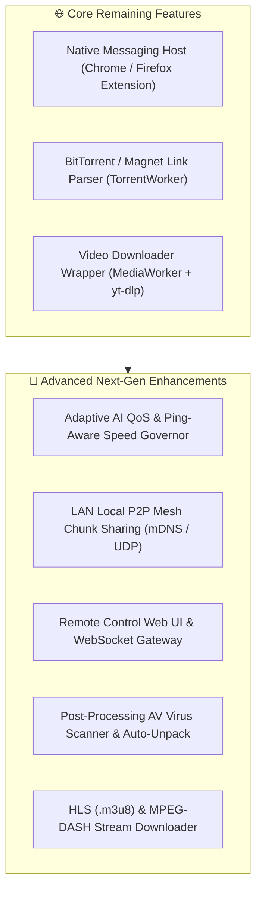

# Implementation Plan — Grabbit Download Manager

> Focused technical blueprint and implementation roadmap of **remaining & advanced features** for **Grabbit**.

---

## 🗺️ Remaining & Advanced Feature Roadmap

---

## 🎯 Detailed Tasks Remaining

### Task 1: Browser Native Messaging Host (Chrome / Firefox Extension Helper)

#### Scope:
- Create `src/main/browser-integration/native_messaging_host.ts` to communicate with Chrome/Firefox extension content scripts over `stdio` using 32-bit length-prefixed JSON frames.
- Provide automated Windows Registry installer script (`HKCU\Software\Google\Chrome\NativeMessagingHosts\com.grabbit.host`).

---

### Task 2: BitTorrent & Magnet Link Handler (`TorrentWorker.ts`)

#### Scope:
- Build magnet URI parsing engine in `src/engine/TorrentWorker.ts`.
- Extract infohashes, tracker lists, and file manifests to display piece progress in the multi-thread chunk inspector.

---

### Task 3: Video Downloader Pipeline (`MediaWorker.ts` + `yt-dlp`)

#### Scope:
- Create wrapper in `src/engine/MediaWorker.ts` around `yt-dlp` executable.
- Parse video resolutions/codecs and pipe video streaming progress into Grabbit task table.

---

## 🚀 Advanced Next-Generation Ideas for Grabbit

### 1. 🧠 Adaptive QoS & Ping-Aware Speed Governor
- **Game / Stream Auto-Detection**: Monitors active network ping or running foreground games/VoIP calls (Discord, Zoom) and automatically throttles download speeds to protect latency, then restores maximum speed when idle.
- **Off-Peak Night Scheduler**: Automatically schedules large downloads (e.g. 50GB ISOs) to run during off-peak hours (e.g., 2 AM – 6 AM).

### 2. ⚡ Local LAN P2P Mesh Chunk Sharing
- **mDNS / UDP Peer Discovery**: If multiple devices on the same Wi-Fi network are downloading the same file, Grabbit nodes discover each other over LAN and exchange chunks at local 1Gbps speeds without downloading from the internet twice.

### 3. 📱 Remote Control Web UI & Mobile Gateway
- **Embedded WebSocket / JSON-RPC Server**: Embedded HTTPS server (`http://localhost:6800`) allowing secure remote task management from mobile phones or external browsers via PIN authentication.

### 4. 🛡️ Post-Processing AV Scanning & Archive Auto-Extract
- **Antivirus VirusTotal / Defender Integration**: Automatically triggers background security scans on finished downloads and displays a green **"Verified Safe"** shield badge or malware alert.
- **Auto-Unpack Archives**: Automatically extracts `.zip`, `.rar`, `.7z`, and `.tar.gz` archives upon download completion.

### 5. 🎬 HLS (`.m3u8`) & MPEG-DASH Stream Downloader
- Segmented media stream parser to download encrypted or chunked HLS/DASH video streams.

---

## 🧪 Verification Plan

### Automated Tests:
- Run `bun run typecheck` to verify zero type mismatches.
- Run `bun run format` to ensure clean Prettier formatting.
