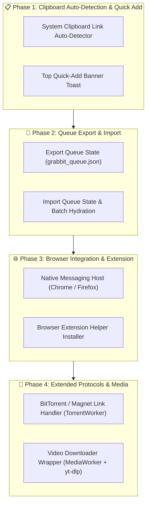

# Implementation Plan — Grabbit Download Manager

> Focused technical blueprint and implementation roadmap of **remaining features** for **Grabbit**.

---

## 🗺️ Remaining Roadmap

---

## 🎯 Detailed Tasks Remaining

### Task 1: Clipboard Link Auto-Detection & Quick-Add Banner

#### Scope:

- Add a periodic or focus-triggered clipboard scanner in `src/renderer/src/hooks/useDownloads.ts` using `navigator.clipboard.readText()`.
- When an HTTP/S downloadable URL (e.g. `.iso`, `.zip`, `.exe`, `.mp4`) or `magnet:?` link is detected in the clipboard, render a sleek floating toast banner with a **"1-Click Add to Grabbit"** action button.

---

### Task 2: Download Queue State Export & Import

#### Scope:

- Implement **Export Download Queue** in `src/renderer/src/components/topbar/MenuBar.tsx` (saves active task list as `grabbit_queue.json`).
- Implement **Import Download Queue** to upload a saved queue JSON file and batch-populate tasks into the engine.

---

### Task 3: Browser Native Messaging Host (Chrome / Firefox Extension Helper)

#### Scope:

- Create `src/main/browser-integration/native_messaging_host.ts` to communicate with browser extensions over `stdio` using 32-bit length-prefixed JSON frames.
- Add installer script to register the Windows Registry key (`HKCU\Software\Google\Chrome\NativeMessagingHosts\com.grabbit.host`).

---

### Task 4: BitTorrent & Magnet Link Handler (`TorrentWorker.ts`)

#### Scope:

- Build magnet URI parsing engine in `src/engine/TorrentWorker.ts`.
- Extract infohashes, tracker lists, and file manifests to display piece progress in the multi-thread chunk inspector.

---

### Task 5: Video Downloader Pipeline (`MediaWorker.ts` + `yt-dlp`)

#### Scope:

- Create wrapper in `src/engine/MediaWorker.ts` around `yt-dlp` executable.
- Parse video resolutions/codecs and pipe video streaming progress into Grabbit task table.

---

## 🧪 Verification Plan

### Automated Tests:

- Run `bun run typecheck` to verify zero type mismatches.
- Run `bun run format` to ensure clean Prettier formatting.

### Manual Verification:

- Copy an HTTP download link, verify quick-add banner pops up, export active queue to JSON, and import back into Grabbit.
