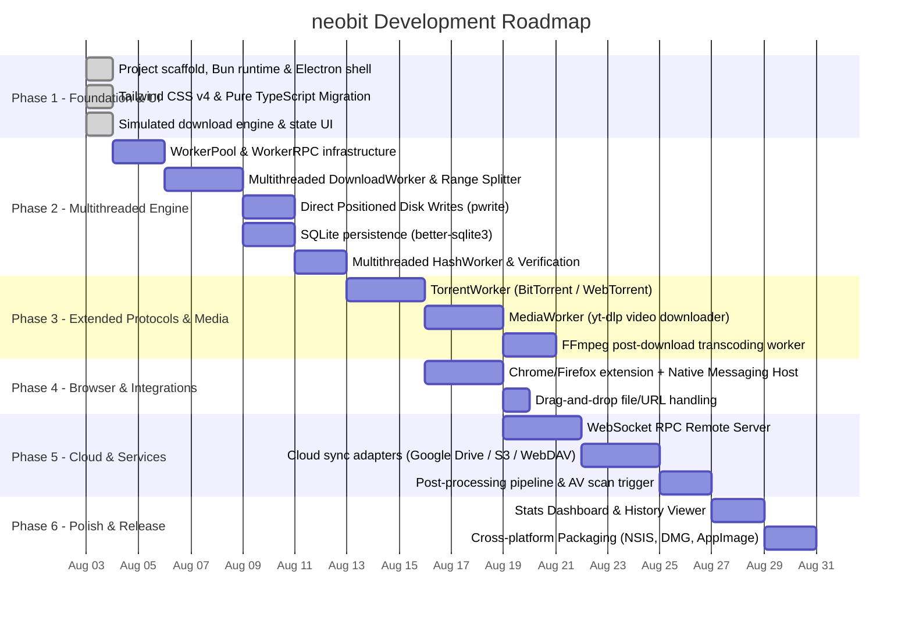

# Implementation Plan — neobit Download Manager

> Comprehensive technical blueprint and implementation roadmap for **neobit** — a modern, high-performance, multithreaded desktop download manager and accelerator built with Electron, React, TypeScript, and Bun.

---

## Architecture & Multithreading Overview

```mermaid
graph TB
    subgraph UI["Renderer Process (React 19 + Vite + Tailwind CSS v4)"]
        Components[App Shell & Dashboard]
        State[Download State & Bandwidth Tracker]
        Visualizers[Chunk Visualizer & Speed Chart]
    end

    subgraph Main["Electron Main Process (TypeScript + Bun)"]
        IPC[IPC Bridge & contextBridge]
        Tray[System Tray & System Notifications]
        Protocol[neobit:// Protocol Handler]
        NMH[Browser Native Messaging Host]
    end

    subgraph Workers["Multithreaded Worker Pool (Node worker_threads)"]
        Pool[WorkerPool Manager]
        ChunkWorker1[DownloadWorker #1: Segments 0..N]
        ChunkWorker2[DownloadWorker #2: Segments N..M]
        HashWorker[HashWorker: SHA-256 / MD5 Hashing]
        TorrentWorker[TorrentWorker: BitTorrent & DHT]
        MediaWorker[MediaWorker: yt-dlp & FFmpeg Pipelines]
    end

    subgraph Storage["Persistence & Storage Layer"]
        SQLite[better-sqlite3 Storage Engine]
        SparseFile[Direct Positioned Disk Write (pwrite)]
    end

    UI <-->|IPC SharedArrayBuffer| IPC
    IPC <--> Pool
    Pool <--> ChunkWorker1 & ChunkWorker2 & HashWorker & TorrentWorker & MediaWorker
    ChunkWorker1 & ChunkWorker2 -->|Direct pwrite| SparseFile
    Pool <--> SQLite
```

---

## Feature → Module Mapping & Status

Each row maps a feature from [features.md](file:///c:/Users/dwaip/OneDrive/Documents/Code/Github/electron%20apps/neobit/features.md) to the module implementing it.

### Download Acceleration and Management (Multithreaded Core)

| Feature                      | Module                                                                               | Status                                                                                                                                             |
| :--------------------------- | :----------------------------------------------------------------------------------- | :------------------------------------------------------------------------------------------------------------------------------------------------- |
| Split Downloads              | `src/engine/workers/DownloadWorker.ts` — Multithreaded HTTP Range segment downloader | 🟡 Simulated in `DownloadManager.ts`. Upgrading to multithreaded worker pool with direct `pwrite` positioning                                      |
| Resume Interrupted Downloads | `src/engine/ChunkEngine.ts` — ETag/byte-offset resume & worker state restore         | 🔴 Not yet built. Persisting chunk byte offsets to SQLite and re-issuing Range requests                                                            |
| Multithreaded Worker Pool    | `src/engine/workers/WorkerPool.ts` — Node `worker_threads` thread manager            | 🔴 Not yet built. Manages dedicated threads per download segment to keep Main process loop unblocked                                               |
| Parallel File Allocation     | `src/engine/DiskAllocator.ts` — Non-blocking sparse file pre-allocation              | 🔴 Not yet built. Pre-allocates disk files (`fallocate` / `SetEndOfFile`) to eliminate disk fragmentation and avoid concatenation delays           |
| Download Queue & Scheduling  | `src/engine/DownloadManager.ts` — Priority queue scheduler                           | 🟢 Built. Priority ordering (high/normal/low), max concurrent limit, auto-start queued tasks                                                       |
| Traffic Limit Control        | `src/engine/RateLimiter.ts` — Multithreaded token bucket algorithm                   | 🟡 Settings UI exists ([SettingsModal.tsx](file:///c:/Users/dwaip/OneDrive/Documents/Code/Github/electron%20apps/neobit/src/renderer/src/App.tsx)) |

---

### Organization and Usability

| Feature                       | Module                                                        | Status                                                                    |
| :---------------------------- | :------------------------------------------------------------ | :------------------------------------------------------------------------ |
| Category Management           | `src/engine/CategoryManager.ts` — Extension → category rules  | 🟢 Built. Auto-categorizes by file extension into 7 categories            |
| File Naming Templates         | `src/engine/NamingTemplates.ts` — Pattern-based renaming      | 🔴 Not yet built. Pattern engine (`{year}/{category}/{filename}`)         |
| Drag-and-Drop Functionality   | `src/renderer/components/DropZone.tsx` — HTML5 drag-drop zone | 🔴 Not yet built. `onDrop` handler extracting URLs/files from drag events |
| Integration with Web Browsers | `src/main/browser-integration/` — Native Messaging Host       | 🔴 Not yet built. Chrome/Firefox extension + NMH manifest installer       |

---

### Advanced Features

| Feature                         | Module                                                                        | Status                                                                                        |
| :------------------------------ | :---------------------------------------------------------------------------- | :-------------------------------------------------------------------------------------------- |
| Multithreaded Hash Verification | `src/engine/workers/HashWorker.ts` — Parallel SHA-256 / SHA-512 / MD5 worker  | 🟡 UI modal exists. Moving hash calculations off the main thread to dedicated `HashWorker`    |
| Video Downloading               | `src/engine/workers/MediaWorker.ts` — `yt-dlp` child process worker           | 🔴 Not yet built. Bundle `yt-dlp` binary, parse format list, pipe progress events             |
| BitTorrent Client Integration   | `src/engine/workers/TorrentWorker.ts` — Multithreaded WebTorrent / libtorrent | 🔴 Not yet built. Parse magnet URIs, display peer/seed counts, piece progress off-main-thread |
| File Conversion                 | `src/engine/workers/MediaWorker.ts` — FFmpeg post-download transcoding worker | 🔴 Not yet built. Bundle `ffmpeg`, run remux/encode as post-processing step                   |
| Remote Access                   | `src/server/RemoteServer.ts` — WebSocket JSON-RPC server                      | 🟡 Settings UI exists. WebSocket server not yet implemented                                   |

---

### Advanced Download Control

| Feature                | Module                                                                     | Status                                                     |
| :--------------------- | :------------------------------------------------------------------------- | :--------------------------------------------------------- |
| Adaptive Speed Limiter | `src/engine/RateLimiter.ts` — Dynamic token bucket with schedule awareness | 🔴 Not yet built                                           |
| Proxy Server Support   | `src/engine/ProxyManager.ts` — HTTP/SOCKS5 proxy routing                   | 🟡 Settings UI field exists. Not wired to download streams |
| IP Address Masking     | `src/engine/ProxyManager.ts` — Route through proxy chain                   | 🔴 Not yet built. Depends on proxy support                 |

---

### Automation and Scripting

| Feature                        | Module                                                                   | Status                                              |
| :----------------------------- | :----------------------------------------------------------------------- | :-------------------------------------------------- |
| Download Scripting             | `src/automation/ScriptRunner.ts` — User JS/shell script executor         | 🔴 Not yet built                                    |
| Integration with Cloud Storage | `src/automation/CloudSync.ts` — Google Drive / S3 / WebDAV adapters      | 🟡 Settings toggle exists. Adapters not implemented |
| Post-Processing Actions        | `src/automation/PostProcessor.ts` — Virus scan, extract, rename pipeline | 🟡 Settings toggle exists. Pipeline not implemented |

---

### Advanced Download Monitoring & Reporting

| Feature                      | Module                                                      | Status                                                       |
| :--------------------------- | :---------------------------------------------------------- | :----------------------------------------------------------- |
| Detailed Download Statistics | `src/renderer/components/StatsPanel.tsx` — Aggregate charts | 🟡 SpeedChart exists. Historical stats panel not built       |
| Bandwidth Usage Monitoring   | `src/engine/DownloadManager.ts` — Bandwidth history array   | 🟢 Built. Real-time bandwidth tracking                       |
| Download Logs and History    | `src/engine/Storage.ts` — SQLite history table + log viewer | 🔴 Not yet built. Using localStorage; needs SQLite migration |

---

## Multithreaded Engine Architecture & Specs

### 1. `WorkerPool.ts` (Thread Pool Manager)

- Spawns and manages a pool of worker threads (`worker_threads.Worker`).
- Dynamically assigns segment download tasks to idle worker threads.
- Implements lock-free atomic message channels (`MessageChannel`) for zero-copy data transfer between main process and worker threads.

### 2. `DownloadWorker.ts` (Parallel Segment Streaming)

- Each download task splits into $N$ connections (configurable 1–32 threads per file).
- Each `DownloadWorker` executes independent `http.get` / `fetch` streams with `Range: bytes=X-Y`.
- Writes chunks directly to disk using `fs.pwriteSync` / `fs.pwrite` at pre-calculated byte offsets in a pre-allocated file descriptor.
- **Zero-Concatenation**: Eliminates costly post-download file merging overhead! When segment 1 and segment 2 finish, the target file is already 100% complete and intact.

### 3. `DiskAllocator.ts` (Sparse File Pre-allocation)

- Pre-allocates destination files instantly on initialization using native fast-allocation API (`posix_fallocate` / `SetEndOfFile`).
- Prevents disk fragmentation on NVMe / SSD / HDD storage during simultaneous multi-connection writes.

### 4. `HashWorker.ts` (Multithreaded Checksum Engine)

- Offloads SHA-256, SHA-512, and MD5 calculations to background threads.
- Uses `SharedArrayBuffer` memory buffers to stream file slices to `crypto.createHash` without copying memory buffers across threads.

---

## Development Roadmap



---

## Verification & Testing Strategy

### Automated Test Suite

```bash
# Typecheck, Lint, and Format Verification
bun run check

# Multithreaded WorkerPool unit tests
bun test src/engine/workers/__tests__/WorkerPool.test.ts

# Multithreaded Positioned Write (pwrite) segment tests
bun test src/engine/workers/__tests__/DownloadWorker.test.ts

# Multithreaded Hash Verification tests
bun test src/engine/workers/__tests__/HashWorker.test.ts

# SQLite Storage persistence tests
bun test src/engine/__tests__/Storage.test.ts
```

### Manual Verification Matrix

| Test Case                           | Verification Procedure                                                                                         |
| :---------------------------------- | :------------------------------------------------------------------------------------------------------------- |
| **Multithreaded 32-Chunk Split**    | Download a 5GB test file across 32 worker threads; verify CPU load is distributed and file writes cleanly.     |
| **Zero-Concatenation Verification** | Verify file is written directly at offset positions without creating `.part0`, `.part1` temp files to merge.   |
| **Non-blocking UI Test**            | Verify UI maintains 60 FPS scrolling and real-time bandwidth graph while 10 threads write to disk.             |
| **Multi-thread Hash Check**         | Run SHA-256 verification on a 10GB file; verify main thread remains 100% responsive while HashWorker computes. |
| **Resume Interrupted Download**     | Sever connection mid-download, reconnect, verify byte ranges resume from exact unwritten offsets.              |
