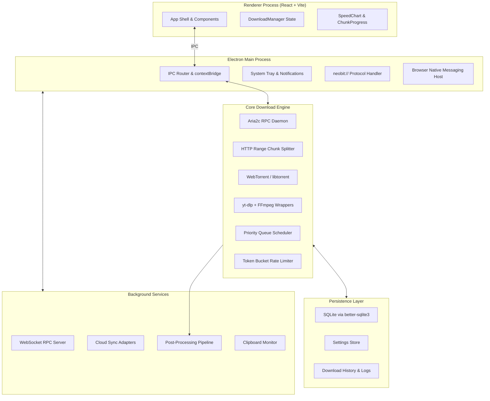
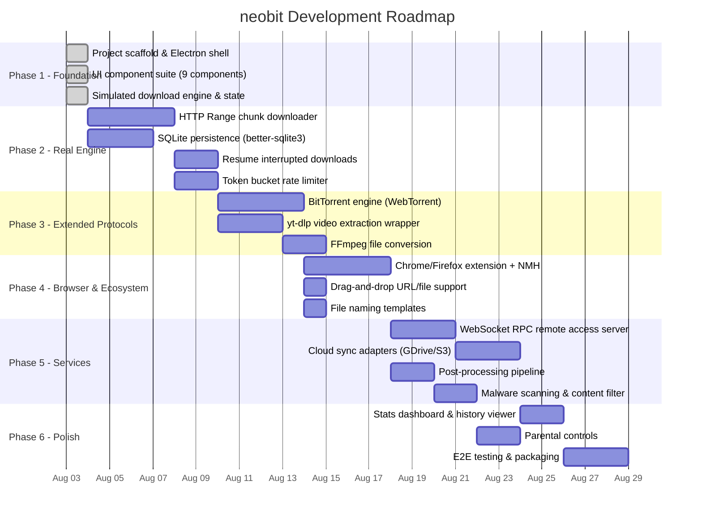

# Implementation Plan — neobit Download Manager

> Full build plan for a cross-platform Electron download manager based on [features.md](file:///c:/Users/dwaip/OneDrive/Documents/Code/Github/neobit/features.md).

---

## Architecture Overview



---

## Feature → Module Mapping & Status

Each row maps a feature from [features.md](file:///c:/Users/dwaip/OneDrive/Documents/Code/Github/neobit/features.md) to the module that implements it. Status shows what exists today vs. what needs to be built.

### Download Acceleration and Management

| Feature | Module | Status |
|:---|:---|:---|
| Split Downloads | `src/engine/ChunkEngine.ts` — HTTP Range multi-connection splitter | 🟡 Simulated in [DownloadManager.ts](file:///c:/Users/dwaip/OneDrive/Documents/Code/Github/neobit/src/engine/DownloadManager.ts). Needs real HTTP Range implementation |
| Resume Interrupted Downloads | `src/engine/ChunkEngine.ts` — ETag/byte-offset resume | 🔴 Not yet built. Requires persisting chunk byte offsets to SQLite and re-issuing Range requests |
| Download Queue and Scheduling | `src/engine/DownloadManager.ts` — Priority queue scheduler | 🟢 Built. Priority ordering (high/normal/low), max concurrent limit, auto-start queued tasks |
| Traffic Limit Control | `src/engine/RateLimiter.ts` — Token bucket algorithm | 🟡 Settings UI exists ([SettingsModal.tsx](file:///c:/Users/dwaip/OneDrive/Documents/Code/Github/neobit/src/renderer/components/SettingsModal.tsx)). Backend throttling logic not wired to real streams |

---

### Organization and Usability

| Feature | Module | Status |
|:---|:---|:---|
| Category Management | `src/engine/CategoryManager.ts` — Extension → category rules | 🟢 Built. Auto-categorizes by file extension into 7 categories |
| File Naming Templates | `src/engine/NamingTemplates.ts` — Pattern-based renaming | 🔴 Not yet built. Needs template engine (`{year}/{category}/{filename}`) |
| Drag-and-Drop Functionality | `src/renderer/components/DropZone.tsx` — HTML5 drag-drop zone | 🔴 Not yet built. Need `onDrop` handler to extract URLs/files from drag events |
| Integration with Web Browsers | `src/main/browser-integration/` — Native Messaging Host | 🔴 Not yet built. Requires Chrome/Firefox extension + NMH manifest installer |

---

### Advanced Features

| Feature | Module | Status |
|:---|:---|:---|
| Video Downloading | `src/engine/MediaEngine.ts` — yt-dlp child process wrapper | 🔴 Not yet built. Bundle `yt-dlp` binary, parse format list, pipe progress events |
| BitTorrent Client Integration | `src/engine/TorrentEngine.ts` — WebTorrent / libtorrent | 🔴 Not yet built. Parse magnet URIs, display peer/seed counts, piece progress |
| File Conversion | `src/engine/MediaEngine.ts` — FFmpeg post-download transcoding | 🔴 Not yet built. Bundle `ffmpeg`, run remux/encode as post-processing step |
| Remote Access | `src/server/RemoteServer.ts` — WebSocket JSON-RPC server | 🟡 Settings UI exists. Server not yet implemented |
| Security & Privacy (hash checking) | `src/engine/HashVerifier.ts` — SHA-256/MD5 calculator | 🟡 UI modal exists ([DownloadCard.tsx](file:///c:/Users/dwaip/OneDrive/Documents/Code/Github/neobit/src/renderer/components/DownloadCard.tsx)). Needs real `crypto.createHash` stream |

---

### Advanced Download Control

| Feature | Module | Status |
|:---|:---|:---|
| Adaptive Speed Limiter | `src/engine/RateLimiter.ts` — Dynamic token bucket with schedule awareness | 🔴 Not yet built |
| Proxy Server Support | `src/engine/ProxyManager.ts` — HTTP/SOCKS5 proxy routing | 🟡 Settings UI field exists. Not wired to download streams |
| IP Address Masking | `src/engine/ProxyManager.ts` — Route through proxy chain | 🔴 Not yet built. Depends on proxy support |

---

### Automation and Scripting

| Feature | Module | Status |
|:---|:---|:---|
| Download Scripting | `src/automation/ScriptRunner.ts` — User JS/shell script executor | 🔴 Not yet built |
| Integration with Cloud Storage | `src/automation/CloudSync.ts` — Google Drive / S3 / WebDAV adapters | 🟡 Settings toggle exists. Adapters not implemented |
| Post-Processing Actions | `src/automation/PostProcessor.ts` — Virus scan, extract, rename pipeline | 🟡 Settings toggle exists. Pipeline not implemented |

---

### Advanced Download Monitoring and Reporting

| Feature | Module | Status |
|:---|:---|:---|
| Detailed Download Statistics | `src/renderer/components/StatsPanel.tsx` — Aggregate charts | 🟡 SpeedChart exists. Per-task & historical stats panel not built |
| Bandwidth Usage Monitoring | `src/engine/DownloadManager.ts` — Bandwidth history array | 🟢 Built. Real-time bandwidth tracking with SVG chart |
| Download Logs and History | `src/engine/Storage.ts` — SQLite history table + log viewer | 🔴 Not yet built. Using localStorage; needs SQLite migration |

---

### Security and Content Management

| Feature | Module | Status |
|:---|:---|:---|
| Malware Scanning | `src/automation/PostProcessor.ts` — OS AV CLI trigger | 🔴 Not yet built. Call `MpCmdRun.exe` (Windows) / `spctl` (macOS) |
| Content Filtering | `src/engine/ContentFilter.ts` — URL/MIME blocklist | 🔴 Not yet built |
| Parental Controls | `src/engine/ContentFilter.ts` — Password-protected blocklist | 🔴 Not yet built |

---

### Additional Considerations

| Feature | Module | Status |
|:---|:---|:---|
| User Interface | Full React component suite | 🟢 Built. 9 components, IDE-inspired dark red theme |
| Platform Compatibility | Electron + electron-builder | 🟢 Built. Windows NSIS, macOS DMG, Linux AppImage configs ready |
| Customization Options | `src/renderer/components/SettingsModal.tsx` | 🟢 Built. 4-tab settings panel (Engine, Network, Automation, Remote) |
| API Integration | `src/server/RemoteServer.ts` — WebSocket JSON-RPC | 🟡 Config UI exists. Server not implemented |

---

## Development Phases



---

## Phase 2 — Real Download Engine (Next Up)

This is the critical phase that replaces the simulated engine with real network I/O.

### [NEW] `src/engine/ChunkEngine.ts`

Real HTTP Range multi-connection downloader:

1. Send `HEAD` request → read `Accept-Ranges`, `Content-Length`, `ETag`
2. Divide total bytes into N slices (configurable 1–32 connections)
3. Spawn N parallel `fetch()` / `http.get()` streams with `Range: bytes=X-Y` headers
4. Write each chunk to a `.part` file on disk via Node `fs.createWriteStream`
5. Track per-chunk byte progress and speed, emit events to renderer via IPC
6. On all chunks complete → concatenate `.part` files into final file
7. Verify `ETag` or user-provided SHA-256 hash

### [NEW] `src/engine/Storage.ts`

Replace `localStorage` with `better-sqlite3`:

- Table `downloads`: id, url, name, save_path, total_size, downloaded_size, status, category, priority, created_at, completed_at, etag, checksum
- Table `chunks`: id, download_id, chunk_index, start_byte, end_byte, downloaded_bytes, status
- Table `settings`: key-value store
- Table `history`: completed download log with timestamps and speeds
- Table `bandwidth_log`: timestamped speed samples for historical charts

### [MODIFY] `src/engine/DownloadManager.ts`

- Replace simulated `processEngineTick()` with real `ChunkEngine` event listeners
- Replace `localStorage` calls with `Storage.ts` SQLite queries
- Wire `RateLimiter.ts` token bucket to chunk download streams

### [NEW] `src/engine/RateLimiter.ts`

Token bucket rate limiter:

- Configurable global ceiling (bytes/sec) and per-task ceiling
- `consume(bytes)` → returns a Promise that resolves when tokens are available
- Adaptive mode: detect system idle hours and allow full bandwidth

---

## Phase 3 — Extended Protocols

### [NEW] `src/engine/TorrentEngine.ts`

- Use `webtorrent` npm package
- Parse magnet URIs and `.torrent` files
- Emit piece-level progress for chunk visualizer
- Report peer count, seed count, upload speed
- Support sequential downloading for media preview

### [NEW] `src/engine/MediaEngine.ts`

- Bundle `yt-dlp` and `ffmpeg` binaries in `resources/` (unpacked asar)
- `extractFormats(url)` → spawn `yt-dlp --dump-json` → parse available formats
- `download(url, format)` → spawn `yt-dlp -f <format> -o <path>` → pipe progress via stdout regex
- `convert(inputPath, outputFormat)` → spawn `ffmpeg -i <input> <output>` → pipe progress

---

## Phase 4 — Browser Integration

### [NEW] `src/main/browser-integration/NativeMessagingHost.ts`

- Register a Native Messaging Host manifest at OS-specific paths
- Listen for JSON messages from browser extension via stdin
- Forward intercepted download URLs to `DownloadManager.addDownload()`

### [NEW] `extensions/chrome/`

- Chrome Manifest V3 extension
- Intercept `chrome.downloads.onDeterminingFilename` → redirect to neobit
- Context menu "Download with neobit" on links and pages
- Badge showing active download count

### [NEW] `src/renderer/components/DropZone.tsx`

- Wrap main content area in HTML5 drag-drop zone
- Accept dragged URLs (text/uri-list) and `.torrent` files
- Show visual overlay on drag-over, auto-open AddDownloadModal on drop

---

## Phase 5 — Background Services

### [NEW] `src/server/RemoteServer.ts`

- Express or bare `ws` WebSocket server on configurable port (default 6800)
- JSON-RPC 2.0 methods: `addUri`, `pause`, `resume`, `remove`, `tellStatus`, `getGlobalStat`
- JWT bearer token authentication from `settings.remoteAccessKey`
- Serves a minimal mobile-friendly web dashboard at `/`

### [NEW] `src/automation/CloudSync.ts`

- Adapter interface: `upload(localPath, remotePath): Promise<void>`
- Google Drive adapter via `googleapis` SDK
- S3-compatible adapter via `@aws-sdk/client-s3`
- WebDAV adapter via `webdav` npm package
- Triggered automatically on download completion if enabled

### [NEW] `src/automation/PostProcessor.ts`

- Pipeline: Download Complete → Hash Verify → AV Scan → Extract Archive → Cloud Upload → Notify
- Archive extraction: `node-7z` for `.zip`, `.rar`, `.7z`, `.tar.gz`
- AV scan: spawn `MpCmdRun.exe -Scan -ScanType 3 -File <path>` on Windows
- User-defined shell scripts via `child_process.exec`

---

## Phase 6 — Polish & Packaging

### [NEW] `src/renderer/components/StatsPanel.tsx`

- Historical bandwidth chart (hourly/daily/weekly)
- Per-category download volume pie chart
- Total data downloaded counter
- Average speed and completion rate metrics

### [MODIFY] `src/renderer/components/SettingsModal.tsx`

- Add Parental Controls tab: password-protected URL/keyword blocklist
- Add Content Filtering tab: MIME type and domain blocklists
- Add Customization tab: theme color picker, font size, layout density

### Packaging & Distribution

```bash
# Windows installer (NSIS)
bun run electron:build

# macOS DMG
bun run build && npx electron-builder --mac --x64

# Linux AppImage
bun run build && npx electron-builder --linux --x64
```

---

## Verification Plan

### Automated Tests

```bash
# Unit tests for chunk byte-range math
bun test src/engine/__tests__/ChunkEngine.test.ts

# SQLite CRUD operations
bun test src/engine/__tests__/Storage.test.ts

# Rate limiter token consumption
bun test src/engine/__tests__/RateLimiter.test.ts

# IPC contract tests
bun test src/main/__tests__/ipc.test.ts
```

### Manual Verification

| Test Case | How to Verify |
|:---|:---|
| Multi-connection split download | Download a 1GB+ test file, verify N `.part` files created, merged correctly |
| Resume after disconnect | Kill network mid-download, reconnect, verify resumes from last byte offset |
| Rate limiting | Set 500 KB/s limit, verify download speed stays within ±10% of limit |
| BitTorrent | Add a magnet link, verify peer discovery and piece download |
| Video extraction | Paste a YouTube URL, verify format selection and download |
| Browser extension | Install Chrome extension, click a download link, verify it routes to neobit |
| Remote access | Connect from mobile browser to `ws://localhost:6800`, add a download |
| Production packaging | Build installer, install on clean Windows machine, verify full functionality |

---

## Current Project Structure

```
neobit/
├── index.html                          # Vite entry HTML
├── package.json                        # ESM, Electron, electron-builder config
├── vite.config.ts                      # Vite + React plugin
├── tailwind.config.js                  # Red accent design tokens
├── tsconfig.json                       # TypeScript config
├── public/
│   └── icon.png                        # App icon (tray, window, installer)
├── src/
│   ├── main/
│   │   ├── main.ts                     # Electron main process
│   │   └── preload.ts                  # contextBridge API
│   ├── engine/
│   │   ├── types.ts                    # Data models & interfaces
│   │   ├── CategoryManager.ts          # Extension → category rules
│   │   └── DownloadManager.ts          # Task scheduler & state (simulated)
│   └── renderer/
│       ├── main.tsx                    # React entry point
│       ├── App.tsx                     # Root component
│       ├── index.css                   # Tailwind + custom styles
│       └── components/
│           ├── Sidebar.tsx             # Explorer tree + filters
│           ├── Header.tsx              # Toolbar + speed badges
│           ├── DownloadList.tsx         # Task list container
│           ├── DownloadCard.tsx         # Individual task card
│           ├── ChunkProgress.tsx        # Chunk segment visualizer
│           ├── SpeedChart.tsx           # Real-time SVG bandwidth graph
│           ├── EngineTerminal.tsx       # Bottom terminal drawer
│           ├── AddDownloadModal.tsx     # New download dialog
│           └── SettingsModal.tsx        # 4-tab preferences
├── dist/                               # Vite production build output
└── dist-electron/                      # Compiled Electron main/preload (.cjs)
```
