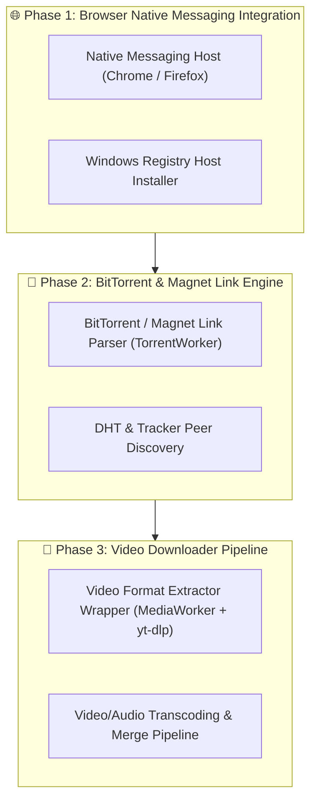

# Implementation Plan — Grabbit Download Manager

> Focused technical blueprint and implementation roadmap of **remaining features** for **Grabbit**.

---

## 🗺️ Remaining Roadmap

---

## 🎯 Detailed Tasks Remaining

### Task 1: Browser Native Messaging Host (Chrome / Firefox Extension Helper)

#### Scope:
- Create `src/main/browser-integration/native_messaging_host.ts` to communicate with Chrome/Firefox extension content scripts over `stdio` using 32-bit length-prefixed JSON frames.
- Provide automated Windows Registry installer script (`HKCU\Software\Google\Chrome\NativeMessagingHosts\com.grabbit.host`).

---

### Task 2: BitTorrent & Magnet Link Handler (`TorrentWorker.ts`)

#### Scope:
- Build magnet URI parsing engine in `src/engine/TorrentWorker.ts`.
- Extract infohashes, tracker lists, and file manifests to display piece progress in the multi-thread chunk inspector.

---

### Task 3: Video Downloader Pipeline (`MediaWorker.ts` + `yt-dlp`)

#### Scope:
- Create wrapper in `src/engine/MediaWorker.ts` around `yt-dlp` executable.
- Parse video resolutions/codecs and pipe video streaming progress into Grabbit task table.

---

## 🧪 Verification Plan

### Automated Tests:
- Run `bun run typecheck` to verify zero type mismatches.
- Run `bun run format` to ensure clean Prettier formatting.
