# Implementation Plan — Grabbit Download Manager

> Comprehensive technical blueprint and implementation roadmap for **Grabbit** — a modern, high-performance, multithreaded desktop download manager and accelerator built with Electron, React 19, TypeScript, and Bun.

---

## 📊 Completed Milestones vs. Remaining Roadmap

```mermaid
graph TB
    subgraph Done["✅ Completed Milestones (v0.0.2)"]
        UI["Modern qBittorrent Dark UI & Sora/Inter Fonts"]
        Architecture["Domain-Driven Modular Architecture (home, network, tasktable, inspector, modals)"]
        Telemetry["Network View Bezier Spline Graph & Hover Tooltip"]
        HomeDashboard["Home Dashboard Engine & Queue Status Panel"]
        Branding["Full App Rebranding to Grabbit"]
        Typecheck["Zero TypeScript & Prettier Errors"]
    end

    subgraph Phase1["🔨 Phase 1: Real Multi-Threaded HTTP Engine"]
        DirectPWrite["Direct Positioned Disk Writes (pwriteSync)"]
        RangeChunking["HTTP Range Segment Streaming (1..32 Threads)"]
        PreAllocation["Sparse File Pre-allocation (DiskAllocator)"]
    end

    subgraph Phase2["⚡ Phase 2: Bandwidth Governor & IPC Sync"]
        RateLimiting["Token-Bucket RateLimiter Governor Integration"]
        IPCRealtime["IPC Real-Time Progress Push Events"]
        PauseResume["Persistent Byte Offset Resume & ETag Check"]
    end

    subgraph Phase3["🔔 Phase 3: OS Integration & Automation"]
        OSNotifications["Native Desktop Notifications (Notification API)"]
        AutoStartBoot["Start on System Boot (setLoginItemSettings)"]
        ClipboardDetect["Clipboard Download Link Auto-Detection"]
    end

    subgraph Phase4["💾 Phase 4: Queue State & Export"]
        QueueExport["Export / Import Download Queue (JSON & Metalink)"]
        BatchDownload["Batch Multi-URL Extractor"]
    end

    Done --> Phase1
    Phase1 --> Phase2
    Phase2 --> Phase3
    Phase3 --> Phase4
```

---

## 🎯 Detailed Remaining Implementation Plan

### 1. Real Multi-Threaded HTTP Range Downloader & Direct `pwrite` Disk Writer

#### Scope & Architecture:

- Upgrade `src/engine/ChunkEngine.ts` to execute real HTTP `Range: bytes=X-Y` requests for each chunk.
- Open file handles using `fs.openSync(path, 'r+')` and write incoming chunk stream buffers directly using `fs.writeSync(fd, buffer, 0, buffer.length, currentOffset)`.
- **Zero Concatenation**: Eliminates intermediate segment files (`.part0`, `.part1`). Files are written at exact byte offsets in real time.

---

### 2. Bandwidth Governor & Token-Bucket RateLimiter Integration

#### Scope & Architecture:

- Connect `src/engine/RateLimiter.ts` to `ChunkEngine` stream throttlers.
- When `maxGlobalSpeedLimitKbps` is configured in `SettingsModal.tsx`, throttle chunk stream chunks via `RateLimiter.removeTokens(bytes)`.

---

### 3. OS Desktop Notifications & Auto-Start Configuration

#### Scope & Architecture:

- Trigger Electron `Notification` API in `src/main/index.ts` whenever a task finishes (`onDownloadCompleted`) or fails (`onDownloadError`).
- Implement `app.setLoginItemSettings({ openAtLogin: startOnBoot })` for Windows startup toggle in `SettingsModal`.

---

### 4. Clipboard Auto-Detection & Quick Add Banner

#### Scope & Architecture:

- Add clipboard polling listener in `useDownloads.ts` using `navigator.clipboard.readText()`.
- When an HTTP file link (`http://.../file.zip`, `https://.../app.exe`) or `.torrent` URL is detected, show a top banner/toast offering 1-click **Add Download**.

---

### 5. Import & Export Download Queue State

#### Scope & Architecture:

- Add **Export Queue State** to `src/renderer/src/components/topbar/MenuBar.tsx` (saves active queue as `grabbit_queue.json`).
- Add **Import Queue State** to parse and populate saved tasks into the download engine.

---

## 🧪 Verification Plan

### Automated Verification:

- Run `bun run typecheck` to verify zero compilation or interface mismatch errors.
- Run `bun run format` to ensure clean code formatting.

### Manual Verification:

- Add real test download URLs (e.g. Ubuntu ISO / test files) and verify multi-threaded chunk downloading, pause/resume, and OS desktop notifications.
